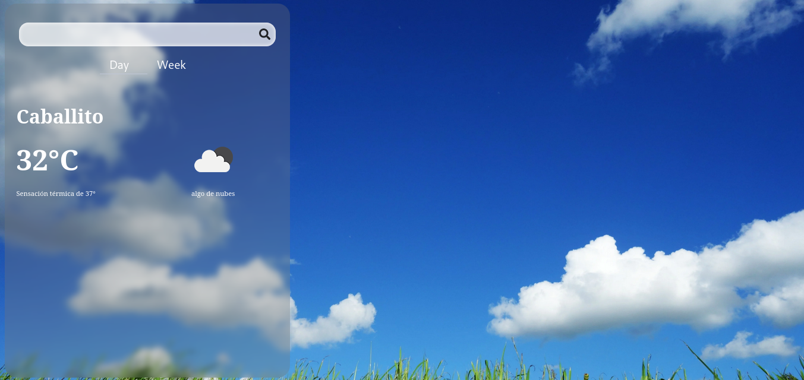

# React Weather

<p align="center">
        <a href="https://vitejs.dev" target="_blank">
          
        </a>
        <a href="https://reactjs.org" target="_blank">
          
        </a>
</p>

<p>
        
</p>
<a href="https://weatherapp-nanob0tt.netlify.app/" target="_blank">Demo</a>

## Run in local environment
1. Clone this repository

2. Install dependencies
```
npm install
```

3. Rename __.env.template__ to __.env__

4. Replace the variable in __.env__ with a working API key from [here](https://openweathermap.org/)

5. Execute the app in dev mode
```
npm run dev
```

6. To run the tests you can use
```
npx vitest
```

